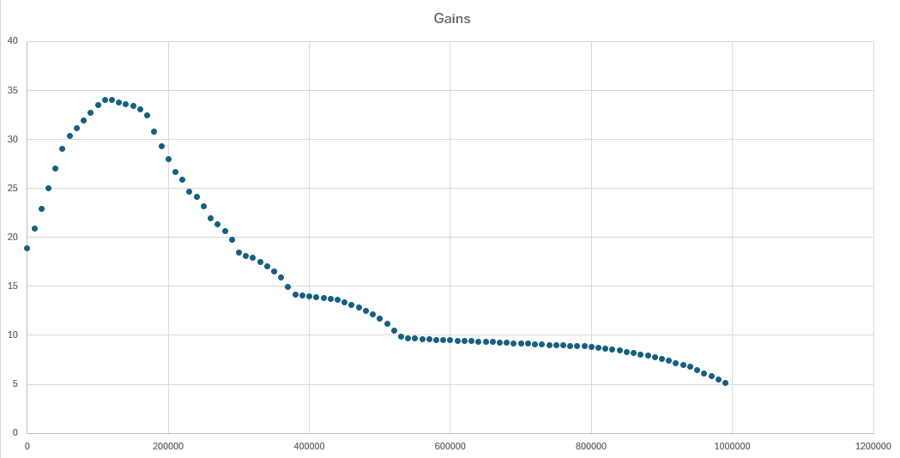
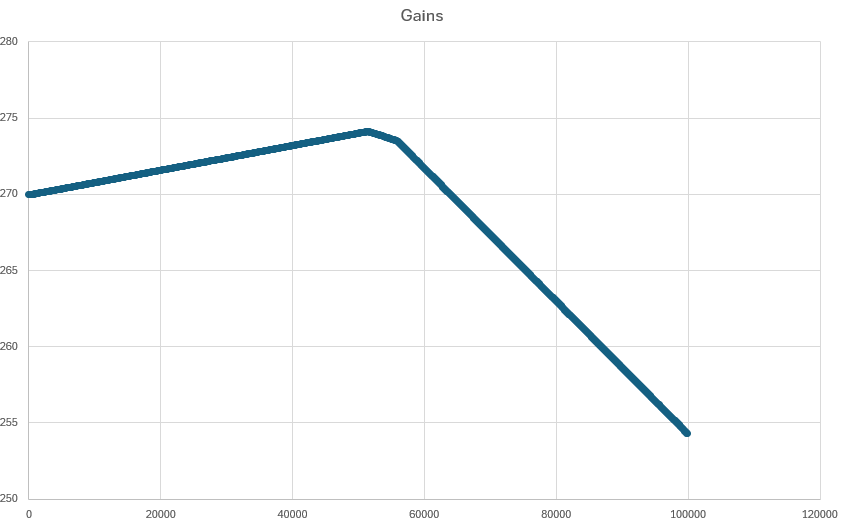

# Insights

First: Pulling out some money is always a good thing. It's being counted in a small tax bracket, when otherwise it would be counted in a larger tax bracket. Note the upwards slope when starting, this is almost always the case.

Settings:
```
// current state of being
const startingCapitalGains = 1e6;
const startingCapital = 1e6;
const yearsLeftAlive = 10;


// expected average interest rate over remainder of lifetime
const interestRate = 0.08
```

Notice how the tax brackets play a role (there's a cutoff at 55000 and 51000ish):

Settings:
```
// current state of being
const startingCapitalGains = 1e6;
const startingCapital = 1e6;
const yearsLeftAlive = 25;


// expected average interest rate over remainder of lifetime
const interestRate = 0.08
```